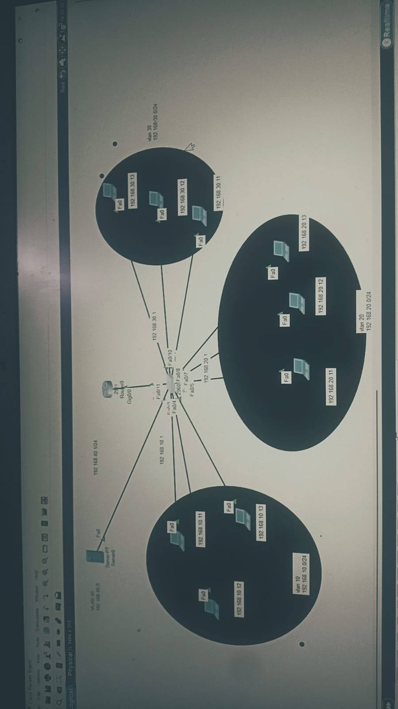

# Small Company Network Design 🖧

A complete network infrastructure design for a small company built on **Cisco Packet Tracer**, featuring VLAN segmentation, Inter-VLAN Routing, DHCP, DNS, and Basic Network Security.

## 📌 Project Overview

This project simulates a small company network with 3 departments, each isolated on its own VLAN, with centralized DNS/DHCP services and secured network devices.

## 🏗️ Network Topology

## 🧩 Components

- **1x Router** (Cisco 2911) — Inter-VLAN Routing (Router-on-a-Stick)
- **1x Switch** (Cisco 2960) — VLAN Segmentation & Trunking
- **9x PCs** — 3 per department
- **1x Server-PT** — DNS + DHCP services

## 🌐 VLAN & IP Addressing Plan

| VLAN | Name   | Network            | Gateway         |
|------|--------|---------------------|------------------|
| 10   | HR     | 192.168.10.0/24     | 192.168.10.1     |
| 20   | IT     | 192.168.20.0/24     | 192.168.20.1     |
| 30   | Sales  | 192.168.30.0/24     | 192.168.30.1     |
| 40   | Server | 192.168.40.0/24     | 192.168.40.1     |

## ⚙️ Features Implemented

- ✅ **VLAN Segmentation** — 4 VLANs isolating departments and the server
- ✅ **Trunking** — 802.1Q trunk link between Switch and Router
- ✅ **Inter-VLAN Routing** — Router-on-a-Stick with sub-interfaces
- ✅ **DNS** — Centralized DNS service resolving `company.local`
- ✅ **DHCP** — Dynamic IP assignment via DHCP Relay (`ip helper-address`)
- ✅ **Basic Security**:
  - Enable Secret & Console passwords on Router and Switch
  - SSH access with local username authentication
  - Port Security (sticky MAC, max 1 per port)
  - Unused switch ports shut down
  - Extended ACL restricting direct communication between HR and Sales VLANs

## 🧪 Testing & Verification

- Ping tests confirming connectivity within and across VLANs
- DHCP-assigned IP verified via `ipconfig /all`
- DNS resolution test: `ping company.local`
- ACL verified: Sales (VLAN 30) blocked from reaching HR (VLAN 10), while still reaching the Server (VLAN 40)

## 📂 Files

- `small-company-network.pkt` — Full Packet Tracer project file
- Topology screenshot included above

## 🛠️ Tools Used

- Cisco Packet Tracer

---

*This project was built as a hands-on exercise in network design, covering fundamental enterprise networking concepts (VLANs, Routing, DHCP, DNS, and Security).*
